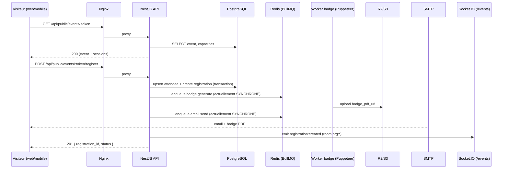

# LFD 2026 — Planification de capacité & cartographie des flux

> Document interne — Base de réponse technique au cahier des charges client.
> Évènement diplomatique public — 4 et 5 septembre 2026.
> Rédigé le 22 mai 2026, à partir de l'audit du repo `attendee-ems-back`
> (branche `gcp-migration-stable`).

---

## 1. Résumé exécutif

La plateforme Attendee EMS (NestJS 10 + Prisma 6 + PostgreSQL 16 + Redis 7 + Socket.IO + Puppeteer)
couvre fonctionnellement l'intégralité du flux demandé : inscription publique multi‑espaces/sessions,
génération badge PDF + QR code, envoi email, check‑in mobile, impression badges via print client
Electron, dashboard temps réel.

**Conclusion infrastructure actuelle** : l'architecture **applicative** est prête, mais
**l'infrastructure de production actuelle (mono‑instance Docker Compose, throttling Nginx 30 req/min,
génération badge + email synchrones dans la requête HTTP) ne peut pas absorber, en l'état,
le pic contractuel de 3 000 requêtes simultanées** ni garantir un SLA de 99,9 % sur la fenêtre
J‑15 → J+1 sans les renforcements décrits aux sections 6 à 9.

Un plan en deux options (A — minimale renforcée, B — robuste scaling horizontal) est proposé
dans la section 6.

---

## 2. Hypothèses & données d'entrée

### 2.1 Données client (cahier des charges)

| Donnée | Valeur |
|---|---|
| Dates événement | 4 et 5 septembre 2026 |
| Fenêtre critique SLA | J‑15 → J+1 (≈ 17 jours) |
| Disponibilité cible | 99,9 % minimum |
| Pic simultané exigé | 3 000 requêtes simultanées à l'ouverture |
| Jauge globale | ≈ 20 000 participants sur 2 jours |
| Inscriptions disponibles | ≈ 12 360 places |
| Capacité instantanée tous espaces | 1 170 personnes |
| Créneaux d'ouverture inscriptions | 09:00, 11:00, 14:00 |

### 2.2 Capacités par espace

| Espace | Capacité instantanée | Total inscriptions espace |
|---|---:|---:|
| Amphithéâtre Nation | 500 | 6 000 |
| Amphithéâtre République | 350 | 4 200 |
| Salle de projection | 120 | 960 |
| Cinéma | 100 | 800 |
| Théâtre | 100 | 400 |
| **Total** | **1 170** | **≈ 12 360** |

### 2.3 Hypothèses de charge

| Hypothèse | Valeur retenue | Justification |
|---|---|---|
| Taux de conversion landing → submit | 60 % | Évènement gratuit, intent fort |
| Temps moyen formulaire (nom/prénom/email) | 25 s | Formulaire court |
| Distribution des arrivées | 70 % en T+0..T+5 min | Comportement "ouverture billetterie" |
| Taille moyenne badge PDF | ~ 80 Ko | Mesure à confirmer en charge |
| Temps moyen génération badge (Puppeteer) | 1,5 à 5 s | Mesuré en local — **à valider en prod** |
| Temps moyen envoi email SMTP | 0,5 à 2 s | Variable selon provider |
| Taux de check‑in à l'entrée (J) | 65 à 80 % des inscrits | Standard évènementiel |

> **Informations à confirmer** :
> - PDF officiel du cahier des charges absent du repo — chiffres utilisés depuis le prompt.
> - Provider email cible production (SMTP en place, mais débit ?).
> - Volumétrie d'emails marketing pré‑évènement (relances).
> - Périmètre géographique (front‑office FR uniquement ?).

---

## 3. Cartographie des flux critiques

### 3.1 Flux inscription publique

| Étape | Fichier | Endpoint / service | Risque |
|---|---|---|---|
| Récup event public | `src/modules/public/public.controller.ts` | `GET /api/public/events/:publicToken` | Cache absent → chaque visiteur tape la DB |
| Submit inscription | `src/modules/public/public.controller.ts` | `POST /api/public/events/:publicToken/register` | Pas de captcha, pas d'idempotency key |
| Upsert attendee + registration | `src/modules/public/public.service.ts`, `src/modules/registrations/registrations.service.ts` | `PrismaService` | Pas de `SELECT FOR UPDATE` sur capacité → surbooking possible |
| Génération badge | `src/modules/badge-generation/badge-generation.service.ts` | Puppeteer singleton | Synchrone dans la requête → bloque l'event‑loop Node |
| Email | `src/modules/email/email.service.ts` | Nodemailer SMTP | Synchrone → timeouts cascadent |
| Emit WS | `src/websocket/websocket.gateway.ts` | namespace `/events`, room `org:${orgId}` | Pas d'adapter Redis → mono‑instance |

### 3.2 Flux génération badge

| Élément | Valeur |
|---|---|
| Module | `BadgeGenerationModule` |
| Librairie | Puppeteer + Chromium (Alpine apk) |
| QR code | `qrcode` |
| Sortie | PDF, PNG, HTML |
| Stockage | Cloudflare R2 (champ `badge_pdf_url`) |
| Statuts | `pending` / `generating` / `completed` / `failed` (`Badge.status`) |
| Mode actuel | Synchrone côté HTTP (pas de job BullMQ dédié à la génération) |
| Coût CPU | Élevé (Chromium headless ≈ 150–300 ms CPU + 1–4 s wall‑time) |

### 3.3 Flux email

| Élément | Valeur |
|---|---|
| Module | `EmailModule` (`src/modules/email/email.service.ts`) |
| Transport | Nodemailer SMTP |
| Variables | `EMAIL_ENABLED`, `SMTP_HOST`, `SMTP_PORT`, `SMTP_USER`, `SMTP_PASSWORD` |
| Templates | `InvitationEmailTemplate`, `PasswordResetEmailTemplate`, `RegistrationNotificationTemplate` |
| Pièce jointe | QR code Buffer inline (cid) + lien PDF |
| Mode actuel | Synchrone, pas de retry, pas de DLQ |

### 3.4 Flux check‑in / scan

| Élément | Valeur |
|---|---|
| Endpoint partenaire | `POST /partner-scans` (`PartnerScansController`) |
| Endpoint check‑in officiel | `POST /api/events/:eventId/registrations/check-in` (`RegistrationsController`) |
| Auth | JWT + `RequirePermissionGuard` |
| Idempotence | Unique constraint DB `unique_partner_scan_per_registration` sur (org_id, event_id, registration_id, scanned_by) |
| Risque | Pas de `WHERE checked_in_at IS NULL` sur l'UPDATE → double check‑in possible si deux scans concurrents |

### 3.5 Flux impression

| Élément | Valeur |
|---|---|
| Module | `PrintQueueModule` (`src/print-queue/print-queue.service.ts`) |
| Architecture | **Map in‑memory** (non persisté) |
| Transport | Socket.IO → print client Electron |
| Découverte imprimantes | Émise par Electron au connect : `registerPrinters()` |
| Risque | Reset complet au redémarrage de l'API |

### 3.6 Flux WebSocket temps réel

| Élément | Valeur |
|---|---|
| Namespace | `/events` |
| Auth | JWT au handshake |
| Rooms | `org:${orgId}` (isolation multi‑tenant) |
| Events émis | `registration:created`, `registration:updated`, `printers:updated`, `print:job` |
| Adapter | **Aucun adapter Redis détecté** — incompatible scaling horizontal |

---

## 4. Scénarios de charge

### 4.1 Vue d'ensemble

| Scénario | Visiteurs simultanés | Submits / min | Écritures DB / min | PDF / min | Emails / min | Scans / min |
|---|---:|---:|---:|---:|---:|---:|
| S1 — Normal (journée pré‑évènement) | 50 à 200 | 30 | 60 | 30 | 30 | — |
| S2 — Pic réaliste 09:00 | 800 à 1 500 | 600 | 1 200 | 600 | 600 | — |
| S3 — Pic extrême contractuel | 3 000 simultanés | 1 800 (sur 60 s) | 3 600 | 1 800 | 1 800 | — |
| S4 — Check‑in J | — | — | 500 | 0 | 0 | 300 à 800 |
| S5 — Mixte (inscriptions + check‑in + print) | 500 + 200 scans | 200 | 600 | 200 | 200 | 300 + 200 prints |

### 4.2 Scénario S1 — Normal

- Inscriptions ouvertes en continu, faible affluence (semaines J‑15 → J‑3).
- Objectif : SLA 99,9 %, p95 < 400 ms, 0 erreur 5xx.
- Charge : tenue trivialement par l'infra actuelle si l'asynchronisation badge/email est en place.

### 4.3 Scénario S2 — Pic réaliste 09:00 / 11:00 / 14:00

- Hypothèse : 60 % des places d'un créneau partent dans les 5 premières minutes.
- Créneau 09:00 le plus chargé (créneau 09:30–12:00 ≈ 4 100 places sur la journée).
- Pic estimé : ~600 submits/min pendant 5 min, soit 50 req/s soutenus, pic instantané ~150 req/s.
- L'infra actuelle (mono‑instance Node, Puppeteer dans la requête) **sature dès 20 req/s** sur le
  POST `/register` à cause des 1,5 à 5 s/badge.

### 4.4 Scénario S3 — Pic extrême contractuel (3 000 simultanés)

- 3 000 connexions ouvertes simultanément sur ~10 s.
- Cible : 50 % submit dans la même fenêtre → 150 req/s soutenus avec rafale 300 req/s.
- **Requiert** : asynchronisation badge + email (queue BullMQ), 2 à 4 instances API derrière un LB,
  rate limit raisonnable (60 req/min/IP, pas 30 req/min global), Postgres avec ≥ 100 connexions et
  PgBouncer côté pool, Prisma `connection_limit` ≥ 20 par instance.

### 4.5 Scénario S4 — Check‑in J

- 12 000 check‑ins répartis sur 6 h = ~33 scans/min en moyenne.
- Pics d'arrivée probables au début de chaque demi‑journée : 200 à 800 scans/min sur 10 min.
- Impressions badge sur place : ~30 % des présents → 60 à 240 prints/min en pic.
- Requête scan = 1 SELECT + 1 UPDATE → légère. Pas de blocage attendu si DB tient.

### 4.6 Scénario S5 — Mixte

- Combinaison : inscriptions tardives + check‑in + impression + dashboard live (WebSocket).
- Risque : saturation du worker Node si génération badge encore synchrone, et saturation Postgres
  si pool sous‑dimensionné.

---

## 5. Estimation de capacité actuelle (constats sur le code)

| Composant | Capacité actuelle estimée | Cible J‑J | Verdict |
|---|---|---|---|
| Throttling Nginx | 30 req/min global (`limit_req_zone … rate=30r/m`) | ≥ 100 req/s | 🔴 Bloquant |
| Throttling NestJS | Absent (seulement sur `n8n.module`) | Rate par IP + global | 🔴 Bloquant |
| Body size cohérence | Nginx 10 Mo vs Express 50 Mo | Aligner à 10 Mo | 🟠 À corriger |
| Génération PDF | Synchrone dans la requête (1–5 s) | Async via BullMQ | 🔴 Bloquant |
| Envoi email | Synchrone dans la requête | Async via BullMQ + retry | 🔴 Bloquant |
| Capacité (jauge) | Pas de `SELECT FOR UPDATE` ni transaction explicite | Verrou pessimiste / upsert atomique | 🔴 Bloquant (surbooking) |
| Double submit | Pas d'idempotency key | Header `Idempotency-Key` ou hash (event_id+email) | 🟠 À ajouter |
| Captcha public | Absent | hCaptcha / reCAPTCHA / Turnstile | 🟠 À ajouter |
| WebSocket multi‑instance | Pas d'adapter Redis | `@socket.io/redis-adapter` | 🟠 À ajouter (option B) |
| Print queue | Map in‑memory | BullMQ + persistance | 🟠 À ajouter |
| Pool Prisma | Défaut (~5–10) | `connection_limit=20` par instance | 🟠 À ajuster |
| Replicas API | 1 (mono‑container) | 2 à 4 (LB) | 🟠 À ajouter |
| Sentry | Présent (`src/instrument.ts`) | OK | ✅ |
| Health endpoint | `GET /api/health` | OK, ajouter `/health/ready` | ✅ |
| Logs | Pino + middleware request logger | OK, agréger | ✅ |
| Backups | Dumps présents dans `backups/` | Automatiser + PITR | 🟠 À industrialiser |

---

## 6. Risques majeurs (synthèse)

| # | Risque | Probabilité S3 | Impact | Mitigation |
|---|---|---|---|---|
| R1 | Saturation event‑loop Node par Puppeteer | Très élevée | Indispo API | Queue BullMQ + workers PDF dédiés |
| R2 | Surbooking sur jauge (race condition) | Élevée | Litige client | Verrou pessimiste DB + check post‑transaction |
| R3 | Pannes SMTP cascadant en 5xx | Moyenne | Indispo perçue | Queue email + retry + circuit breaker |
| R4 | DDoS / bots sur `/register` | Élevée | Indispo + base polluée | Captcha + rate limit IP + WAF Cloudflare |
| R5 | Perte de print jobs au redémarrage | Moyenne | Impression KO | BullMQ persisté |
| R6 | WebSocket désynchro entre instances | Si scaling horizontal | Dashboard partiel | Adapter Redis Socket.IO |
| R7 | Snapshot DB non testé en restore | Inconnue | RTO non garanti | Tester restore avant J‑15 |
| R8 | Helmet manquant, CSP non appliqué côté Node | Moyenne | Score sécurité | `app.use(helmet())` |

---

## 7. Recommandation d'infrastructure

### Option A — Minimale renforcée (recommandée pour budget contraint)

| Composant | Choix |
|---|---|
| API | 2 instances NestJS (PM2 cluster ou Docker Compose `replicas: 2`) derrière Nginx |
| Worker | 1 process séparé (badges + emails via BullMQ) |
| Reverse proxy | Nginx déjà en place + Cloudflare devant (WAF + DDoS + cache statique) |
| DB | PostgreSQL managé (Cloud SQL ou équivalent), 4 vCPU / 8 Go, backups quotidiens + PITR 7 j |
| Redis | Redis managé, 1 Go, persistance AOF |
| Stockage | Cloudflare R2 (déjà utilisé pour badges) |
| Monitoring | Sentry + Uptime Robot / Better Uptime + logs Loki/Grafana Cloud |
| Backups | `pg_dump` quotidien + snapshot DB managé |
| Déploiement | Docker Compose, image immuable, rollback par tag |

- **Avantages** : faible complexité, coût modéré, opéré par 1 dev.
- **Inconvénients** : pas de haute disponibilité région, scaling vertical limité.
- **Risques restants** : panne hôte unique → RTO 15–30 min.
- **Coût/complexité** : **faible à moyen**.

### Option B — Robuste (recommandée pour exigence client stricte 99,9 %)

| Composant | Choix |
|---|---|
| API | GKE / Cloud Run, 3 à 6 replicas autoscaling sur CPU + req/s |
| Workers | Deployments dédiés `worker-badge`, `worker-email`, autoscaling sur taille de queue |
| LB | Cloud Load Balancer HTTPS managé |
| DB | Cloud SQL HA (failover régional), 8 vCPU / 16 Go, PITR 30 j |
| Redis | Memorystore HA |
| WebSocket | Adapter Redis Socket.IO, sticky sessions |
| CDN | Cloudflare ou Cloud CDN pour assets statiques |
| Monitoring | Sentry + Prometheus + Grafana + alerting PagerDuty/Opsgenie |
| Staging | Environnement iso‑prod permanent |
| Tests | k6 dans la CI, smoke tests post‑deploy, rollback automatique |

- **Avantages** : SLA 99,9 % atteignable, scaling élastique, MTTR < 5 min.
- **Inconvénients** : coût + complexité ops.
- **Risques restants** : surcoût si évènement unique ; nécessite compétence Kubernetes.
- **Coût/complexité** : **moyen à élevé**.

### Recommandation finale

> Option **B** pour respecter strictement le 99,9 % contractuel sur J‑15 → J+1.
> À défaut, **Option A** avec engagement SLA réduit à **99,5 %** sur la même fenêtre,
> et engagement 99,9 % uniquement sur les 2 journées J et J+1.

---

## 8. Informations à confirmer avec le client

1. Provider et quotas SMTP retenus pour la production (envoi de masse autorisé ?).
2. PDF officiel du cahier des charges (jauges, créneaux, contraintes RGPD).
3. Hébergement souhaité (GCP, Scaleway, OVH, on‑prem ministère ?).
4. Périmètre géographique des utilisateurs (FR uniquement / international ?).
5. Données collectées au formulaire (champs additionnels au‑delà de nom/prénom/email ?).
6. Politique de relances email (J‑7, J‑1, J+0 ?) — volume à anticiper.
7. Présence d'un WAF/CDN imposé par le client (ANSSI, Cloudflare Enterprise…).
8. Engagements RGPD (DPO, registre, durée de conservation).
9. Plage horaire d'astreinte (24/7 ou 06h‑22h sur 4–5 sept ?).
10. Acceptation des modes dégradés décrits dans le PCA.
