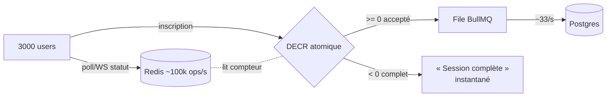

# Pic d'inscription temps réel : séparer lecture et écriture

> **Date :** 2026-07-08 · **Contexte :** LFD 2026 — 3000 inscriptions quasi simultanées sur des
> sessions à capacité limitée, avec statut (pleine/fermée) affiché en direct.
> **En une phrase :** sous forte charge, on **sépare le chemin lecture (statut) du chemin écriture
> (inscription)** et on ne se fie **jamais** au chiffre affiché pour la correction — la vérité, c'est
> un **compteur atomique Redis**.

---

## Le piège : tout mélanger

« 3000 personnes s'inscrivent en même temps ET voient l'état live » paraît insurmontable parce qu'on
empile **trois problèmes distincts**. Séparés, chacun a une solution connue :

| # | Problème | Nature | Solution |
|---|---|---|---|
| 1 | 3000 inscriptions simultanées | débit / concurrence | **file d'attente** (BullMQ) |
| 2a | ne pas survendre une session | correction / vérité | **compteur atomique Redis** |
| 2b | afficher le statut live | temps réel | **WebSocket / poll caché** |

---

## Séparer LECTURE et ÉCRITURE (le principe central)

| Chemin | Trafic (3000 users) | Où il va | Plafond |
|---|---|---|---|
| **Lecture** (statut, poll) | ~1000 req/s (poll 3s) | **Redis / cache / WebSocket** | énorme |
| **Écriture** (inscription) | rafale de 3000 | **file BullMQ → Postgres** | ~33/s drainé |

Les deux ne se gênent pas : **Postgres ne voit que les écritures drainées** (~33/s). Les 1000
lectures/s vivent **entièrement dans Redis**. Chaque couche est dimensionnée pour son rôle.

> ⚠️ **Le seul vrai piège :** que le polling touche Postgres. 1000 lectures/s sur la DB = mort.
> Il **doit** lire Redis/cache. Redis fait ~100 000 ops/s → 1000/s = 1 % de sa capacité.

---

## 2a — Le compteur atomique : la « vérité »

Si une session a **100 places** et que **3000** la visent, le danger n'est **pas** le débit global :
c'est que **3000 requêtes touchent la même ligne** en base → verrous en série → lenteur + **survente**.

**Solution — Redis comme portier :**

- `DECR session:X:places` → opération **atomique**, ultra-rapide.
- résultat **≥ 0** → **accepté** ; **< 0** → **« complet »**, rejeté **instantanément**.
- seuls les acceptés partent en **file** vers Postgres pour être persistés.

Ça transforme un **goulot « ligne chaude » en base** (lent, sérialisé) en une **opération Redis**.

> 🔑 **Le modèle mental qui débloque tout :** ne jamais se fier au **chiffre affiché** pour la
> correction. L'affichage est *indicatif* (droit à 1-2s de retard). La **vérité**, c'est le `DECR`
> atomique **au moment de la soumission**. Un user voit encore « 3 places », clique, le `DECR` renvoie
> < 0 → **« désolé, complet »** proprement. Zéro survente, et l'UI n'a pas besoin d'être parfaitement
> temps réel.

---

## 2b — Afficher le live : WebSocket viable ?

**Oui, 3000 connexions = modeste** pour une instance socket.io (les setups réglés montent à 100k+).
La RAM d'une connexion idle ≈ 10-40 KB → `3000 × 20 KB ≈ 60 MB`. Le coût n'est **pas** le nombre de
connexions, c'est le **débit de broadcasts** — or le statut change rarement.

**WebSocket est même plus léger que le polling** ici : le polling = 1000 req/s en continu même quand
rien ne change ; le WS = connexions idle + un broadcast **au changement**.

### Les vrais pièges (config, pas capacité)

1. **`ulimit -n`** : 1 socket = 1 fd, défaut souvent 1024 → à monter (`LimitNOFILE`). Piège n°1.
2. **nginx** : headers `Upgrade`/`Connection` + `proxy_read_timeout` longs, sinon coupures.
3. **Throttle du fan-out** : diffuser **au changement significatif** (ouvert → presque plein → complet
   → fermé) ou max 1x/1-2s, pas 1 broadcast par inscription.
4. **Rooms par session** : broadcaster **seulement** aux watchers d'une session, pas aux 3000.
5. **Tempête de reconnexion** au redémarrage → backoff aléatoire (socket.io par défaut).
6. **Sticky sessions** : seulement en **multi-instance** → non concerné en **mono-instance**.

### Replis valables (si le WS stresse)

- **SSE** (Server-Sent Events) : push unidirectionnel, plus simple que le WS (HTTP, reconnexion auto).
- **Polling caché** : poll 2-3s **avec cache HTTP/CDN court (1-2s TTL)** → l'origine ne voit presque rien.

---

## L'archi cible sous pic

1. **Redis compteur atomique** = portier anti-survente (vérité).
2. **File BullMQ** = tampon des inscriptions (protège Postgres à ~33/s).
3. **WebSocket/poll caché** = affichage live, retard toléré.
4. **Mono-instance verticale** = suffisant pour l'event (le multi-instance = redis-adapter, post-event —
   cf. [scaling horizontal stateless](2026-07-08-scaling-horizontal-stateless.md)).

---

## Démarrage à froid : le cache stampede

À la **première visite**, chaque user charge **2 choses** : (A) le **bundle front** (statique) et
(B) un **read initial** (état des sessions). D'où deux pièges :

- **(A) bundle** → doit être servi par un **CDN / statique**, jamais l'API. Sinon 3000 téléchargements
  concurrencent l'API sur le même VPS.
- **(B) read initial sur cache FROID** → **cache stampede** : 3000 requêtes arrivent en même temps sur
  un cache vide → si rien ne les coordonne, **les 3000 passent jusqu'à Postgres** pour reconstruire la
  valeur → exactement le pic qu'on voulait éviter.

**Parades (combinables) :**
1. **Pré-chauffer le cache** (cache warming) **avant** d'ouvrir les inscriptions → cache déjà chaud à
   l'ouverture → 0 requête Postgres. Idéal quand l'heure d'ouverture est connue.
2. **Single-flight / request coalescing** : sur cache froid, **une seule** requête reconstruit, les
   autres **attendent** ce résultat (verrou court) au lieu de taper toutes Postgres. Les CDN le font
   nativement (« request collapsing »).

---

## Cohérence du cache : Redis-**vérité** vs Redis-**cache**

Deux usages de Redis, **deux façons de le tenir à jour** :

| Usage | Exemple | Mise à jour |
|---|---|---|
| **Redis = vérité** (petit, critique) | `session:X:places`, `:open` | l'API **écrit directement dedans** — pas d'« invalidation », il n'y a qu'**une** vérité |
| **Redis = cache** (dérivé, lourd) | liste sessions + stats | **write-through** (réécrire à la modif) **+ TTL court** (filet) ± delete-on-write + single-flight |

> Règle : données **critiques et petites** → Redis = vérité (zéro problème de cohérence). Données
> **dérivées et lourdes** → Redis = cache (write-through + TTL).

---

## Pull + Push : snapshot + stream

Le **cache (read/pull)** et le **WebSocket (push)** sont **deux mécanismes séparés** mais branchés sur
**la même vérité Redis**. Ils se **complètent**, ne se concurrencent pas :

- **Pull = snapshot** : « c'est quoi l'état **maintenant** que j'arrive ? » (chargement, reconnexion).
- **Push = stream** : « préviens-moi **quand** ça change » (pendant que je suis là).

**Pattern client :** au chargement → **pull** l'état (snapshot), puis **s'abonner** au WS (stream).

### « Même vérité » ≠ « lire physiquement Redis »

Analogie du **tableau de score** (= Redis, la vérité) : le **pull** = tu marches regarder le tableau ;
le **push** = un speaker crie le nouveau score **quand il change**. Le speaker **n'invente rien**, il
crie **ce qui vient d'être inscrit au tableau**. Séparés dans le **transport**, identiques dans la
**source**.

### Deux règles pour ne JAMAIS diverger
1. **Un seul écrivain** : seule l'API écrit l'état, **dans Redis**. Le push ne calcule pas une valeur
   « à part » → sinon deux vérités.
2. **Ordre : écrire Redis PUIS émettre.** Sinon un client peut recevoir le push (nouvelle valeur) puis
   pull l'**ancienne**.

### État **absolu**, pas delta
L'event WS transporte l'**état complet** (« places = 12 », « fermée »), pas un incrément (« −1 »).
→ un event **raté se corrige tout seul** (le suivant écrase), l'**ordre** n'importe plus, et le format
du push = celui du pull. Avec des deltas, un event perdu **corromprait** le compteur.

---

## Le WebSocket « écoute »-t-il Redis ? Mono vs multi

Redis a **deux casquettes** : **store clé-valeur** (la vérité, lue par le pull) et **bus pub/sub**
(notifier un changement). La question « le WS écoute Redis ? » porte sur le **bus** :

| | **Mono-instance** (event) | **Multi-instance** (post-event) |
|---|---|---|
| Push | **emit direct** (même process) | via **Redis pub/sub** |
| Le WS écoute Redis ? | **NON** | **OUI** |
| Pourquoi | tout est en mémoire locale | l'état change sur A, le client est sur B → bus partagé obligatoire |

> Le passage « emit direct » → « écoute pub/sub » **est** exactement le `redis-adapter` de socket.io,
> **la brique qui débloque le multi-instance**. Rien à faire pour l'event (mono-instance) ; obligatoire
> après (cf. [scaling horizontal stateless](2026-07-08-scaling-horizontal-stateless.md)).
