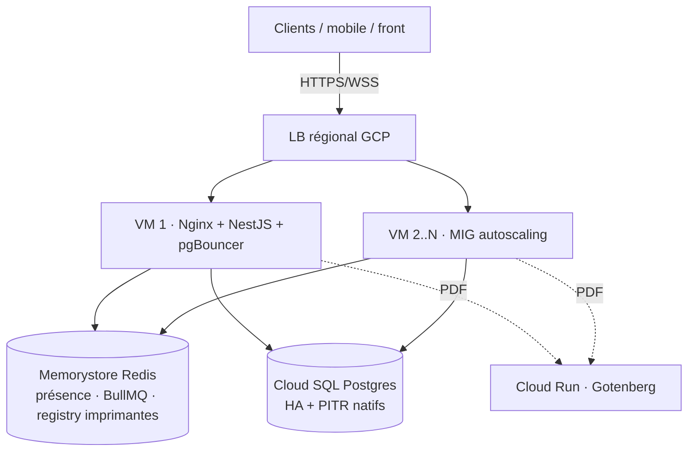

# Archi cible GCP — Stratégie B (visée directement), mono-instance au début

> **Réfs :** [README workstream](./README.md) · [analyse Entiovi](./00-analyse-proposition-entiovi.md) ·
> [chantier clustering (verrou)](../../en-cours/api-scaling-clustering/README.md).

---

## 1. Cible : Stratégie B (autoscaling), atteinte en un seul cutover

- **Cloud SQL** : Postgres managé, **HA + PITR natifs** (= chantier F obtenu « gratuitement »).
- **Memorystore Redis** : état partagé cross-VM — **présence, BullMQ, registry imprimantes, Socket.IO adapter**.
- **LB régional + MIG** : autoscaling `min..max`, le LB route autour des VMs mortes (zéro downtime).
- **Nginx par VM** : SSL (Let's Encrypt), reverse proxy, statique, rate-limit, upgrade WS, gzip.
- **pgBouncer par VM** : pooling vers Cloud SQL (identique à aujourd'hui).
- **Cloud Run (Gotenberg)** : génération PDF déportée (déjà déployé).

## 2. Ce qui sépare « aujourd'hui » de la cible

| Brique | Aujourd'hui (OVH) | Cible B | Delta |
|---|---|---|---|
| DB | Postgres autogéré VPS | **Cloud SQL** managé | infra (Entiovi) |
| Reverse proxy | Nginx | Nginx par VM | ≈ identique |
| Pooling | pgBouncer | pgBouncer par VM | ≈ identique |
| Redis | in-VM | **Memorystore** | infra + **code stateless** |
| Scaling | mono-instance | **MIG + LB** | infra + **code stateless** |
| État (présence/imprimantes/socket) | **en process** | **en Redis partagé** | ⛔ **chantier clustering** |

➡️ **Le seul travail « dur » = rendre le code stateless** (dernière ligne). Tout le reste est de la
pose d'infra qu'Entiovi maîtrise.

## 3. Séquence (un seul cutover)

1. **Entiovi** : VPC, Cloud SQL, Secret Manager, CI/CD, Nginx/pgBouncer, **+ Memorystore + MIG + LB**.
2. **Nous** : [chantier clustering](../../en-cours/api-scaling-clustering/README.md) — présence + registry
   imprimantes en Redis, `socket.io-redis-adapter`, zéro état en process, pooling Prisma validé.
3. **Cutover** : migration données OVH→Cloud SQL (dump/restore ou DMS), bascule DNS, **mono-instance
   `min=max=1`** d'abord ; **autoscaling `min≥2`** allumé **après** validation du clustering.

> **🔀 Option dé-risquage :** cutover en **mono-instance** (code encore stateful) pour valider la
> migration infra/DB **seule**, puis stateless + autoscaling en 2ᵉ temps. Évite migration cloud + gros
> refactor dans le même big-bang.

## 4. Rôle d'OVH après migration

- **Staging / pré-prod** (réutilise l'existant) ✅ **défaut recommandé**.
- **Backup offsite / cold DR** (dumps hors GCP, filet cross-cloud) ✅.
- **Jamais** un nœud live de B (cross-cloud actif-actif écarté).
- Décommission possible si on centralise tout sur GCP (staging via projet GCP séparé).

## 5. Garde-fous

- ⛔ Autoscaling **interdit** tant que le clustering n'est pas livré (survente d'état / bugs cross-VM).
- 🔐 Rotation des credentials partagés le 9 avril + Secret Manager.
- 🗓️ **Post-event** : rien ne bascule avant le 4-5 sept.
