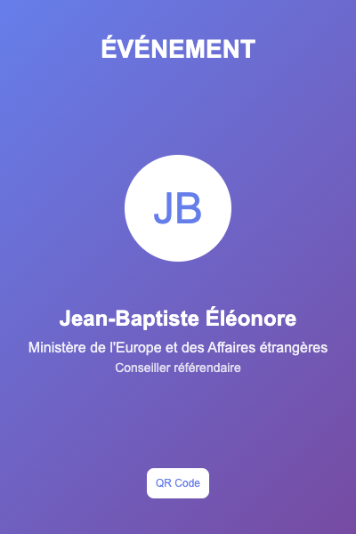
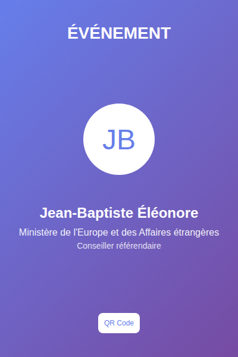
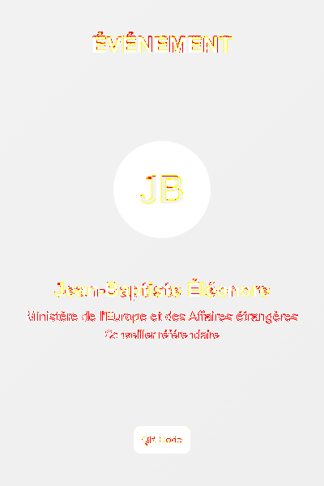
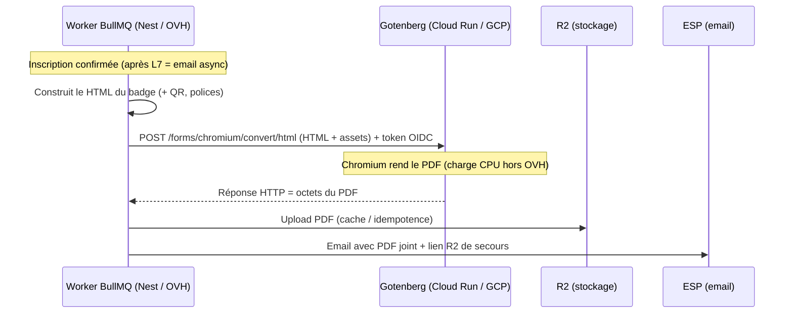

# Brief — Call GCP (billet PDF via Gotenberg sur Cloud Run)

> Chantier B (LFD 2026). Support pour la review avec l'équipe GCP.
> POC réalisé en local le 2026-07-08 (aucun déploiement encore).
> Code + rendus du POC : `attendee-ems-back/temp/gotenberg-poc/` (branche `chore/gotenberg-cloudrun-poc`).

## 1. Objectif

Sortir la génération du **billet/badge PDF** du VPS OVH (goulot CPU mesuré) vers un service
managé **Gotenberg sur Cloud Run** — **même moteur Chromium**, charge déportée, faisable
**sans migrer toute l'app** sur GCP.

## 2. Ce qui est déjà prouvé (POC local)

- **Rendu hors OVH OK** : badge rendu par Gotenberg → `output.pdf` (PDF valide, 1 page).
- **Fidélité mesurée** (Puppeteer prod vs Gotenberg, même template réel) :
  - Écart global : **0,94 %** (2 253 px / 240 000).
  - Écarts **uniquement sur l'anti-aliasing du texte** ; layout / positions / couleurs / dégradé **identiques**.
  - Accents `É è à` **rendus correctement** des deux côtés (pas de police manquante).
  - Comparateur réutilisable : `attendee-ems-back/temp/gotenberg-poc/compare.sh`.

### Rendus du POC (comparaison)

| Puppeteer (prod)                          | Gotenberg (Cloud Run)                     | Diff (rouge = écart)            |
| ----------------------------------------- | ----------------------------------------- | ------------------------------- |
|  |  |  |

### ⚠️ À VÉRIFIER DEMAIN — différence de rendu (font)

Le rendu Puppeteer et Gotenberg **diffère légèrement, surtout au niveau de la police** (le diff se
concentre sur les contours de texte). Hypothèse : **versions de Chromium différentes** (Puppeteer 24
vs Gotenberg 8) → hinting/anti-aliasing différent. **À trancher demain :**

- [ ] Confirmer que l'écart est **bien uniquement de l'anti-aliasing** (et pas une substitution de police).
- [ ] Rejouer le comparateur sur le **template définitif** de l'event (polices **custom / Google Fonts**)
      — voir `real-template.json` + requête d'export SQL (§6). **C'est là qu'est le vrai risque.**
- [ ] Décider si on **embarque les polices** dans la requête Gotenberg (fidélité + offline) plutôt que
      de dépendre de Google Fonts au runtime.
- [ ] Si besoin d'un rendu **pixel-identique** : aligner la **version de Chromium** entre les deux moteurs.

## 3. Architecture cible

### Connexion Cloud Run ↔ API Nest (les deux sens)

- **Sens aller** : c'est **Nest (OVH) qui appelle Cloud Run** en HTTPS sortant.
- **Sens retour** : le PDF revient **dans la réponse HTTP de la même requête** (synchrone).
  **Cloud Run n'appelle jamais** l'API Nest / OVH.
- Conséquences (arguments à défendre) :
  - ✅ **Aucun flux entrant vers OVH** à ouvrir → surface d'attaque minimale, pas de webhook.
  - ✅ Cloud Run **stateless** : ne connaît ni la DB, ni R2, ni l'email. HTML entrant → PDF sortant.
  - ❌ On écarte le modèle « Cloud Run écrit dans R2 / rappelle Nest » (credentials + flux entrant + couplage).

## 4. Les 12 points à évoquer avec l'équipe GCP

1. **Projet & billing** — quel projet GCP héberge le service ? qui paie ? (event : < 1 € à ~12 €).
2. **Auth service-to-service** — Cloud Run en `--no-allow-unauthenticated` + **token OIDC** d'un
   service account côté OVH. **Point technique clé.**
3. **Région** — `europe-west1` / `europe-west9 (Paris)` ? (latence OVH→GCP + résidence des données MEAE).
4. **Egress OVH→GCP** — simple HTTPS sortant ; faut-il une IP fixe / allowlist côté GCP ?
5. **Cold start** — `min-instances = 1` pendant les 2 jours d'event (Chromium = démarrage lent).
6. **Polices** — on **embarque les fonts** dans la requête, ou on dépend de Google Fonts (réseau) ?
   (fidélité + offline). **C'est le principal risque de compat restant.**
7. **Timeout & taille** — timeout requête Cloud Run (60 s Gen2 par défaut) OK pour un badge ; limite de payload.
8. **Concurrence / scaling** — instances max au pic ? (rendu des ~3 000 badges déporté hors VPS).
9. **Observabilité** — logs Cloud Run + alerte si le rendu échoue (lié au chantier 0-MON).
10. **Rétention** — le PDF vit sur R2 (pas sur Cloud Run) ; durée + purge post-event.
11. **Secrets** — clé / service account stockée où côté OVH (Secret Manager vs `.env`).
12. **Réversibilité** — le **fallback Puppeteer local reste en place** tant que Cloud Run n'est pas
    validé pixel-à-pixel sur le template définitif.

## 5. Environnements de test (où on teste quoi)

| Étape                | Où              | Ce qu'on valide                                    | Impact prod/staging             |
| -------------------- | --------------- | -------------------------------------------------- | ------------------------------- |
| 1. Local (fait)      | Docker sur Mac  | Fidélité (diff pixel-à-pixel)                      | Aucun                           |
| 2. Cloud Run déployé | GCP             | HTTPS + auth OIDC, cold-start, coût réel           | Aucun (service isolé)           |
| 3. Branchement back  | staging d'abord | Worker Nest appelle Cloud Run au lieu de Puppeteer | staging puis prod, **après L7** |

## 6. Prochaines étapes (après le call)

- **Chemin B** — déployer réellement sur Cloud Run (bloqué : `gcloud` non installé + projet GCP à fournir).
  Une fois projet + région connus → script `gcloud run deploy` (image `gotenberg/gotenberg:8`,
  `--no-allow-unauthenticated`, `--min-instances`) + smoke test.
- **Compat template réel** — exporter un `html_snapshot` de staging/prod dans `real-template.json`,
  relancer `./compare.sh`.
- **Branchement worker** — **après L7** (email async), testé sur staging, fallback Puppeteer conservé,
  bascule prod après comparaison pixel-à-pixel.

## 7. Rappel — contexte à corriger

`workstreams/en-cours/lfd2026/00-plan-action.md` (statut B0 « Cloud Run déjà fait ») et
`workspace-rabie/NOW.md` (« setup Cloud Run déjà effectué ») sont **inexacts** : rien n'est déployé,
seul le **POC local** est fait. À repasser en « POC local fait, déploiement Cloud Run à faire ».
