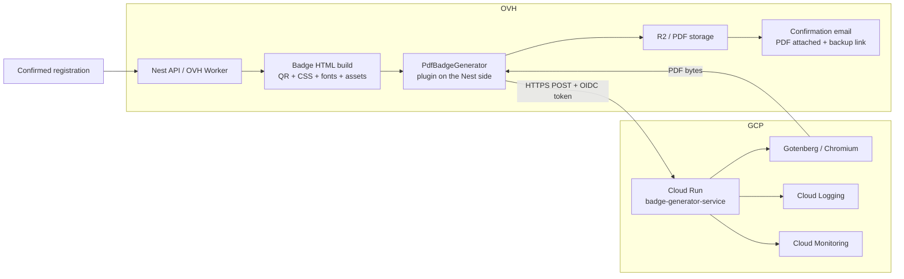
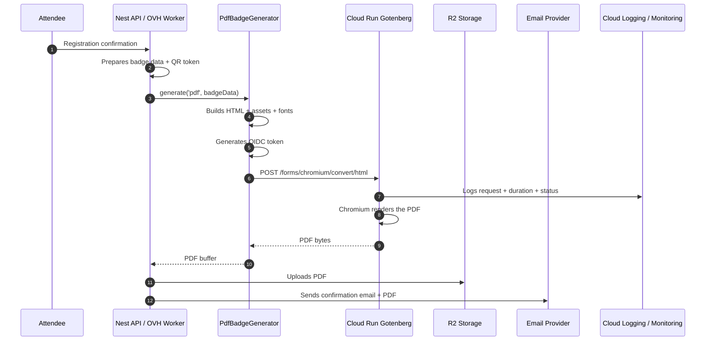
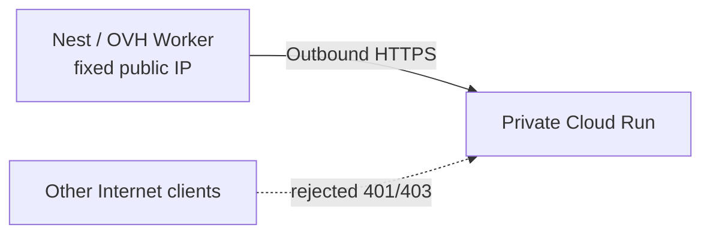
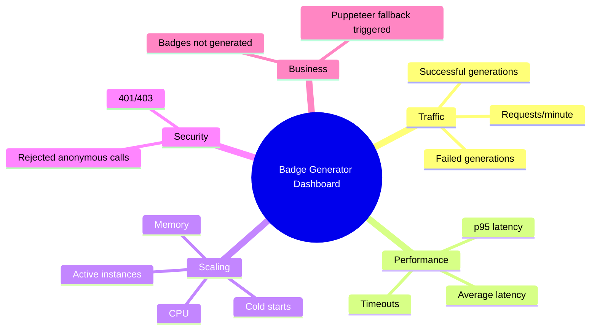
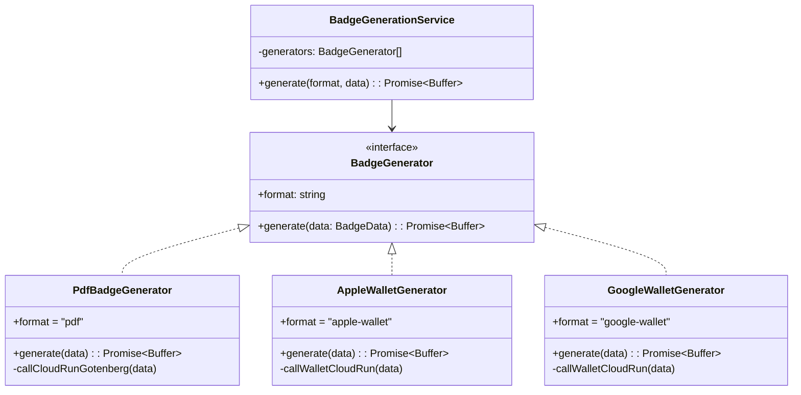
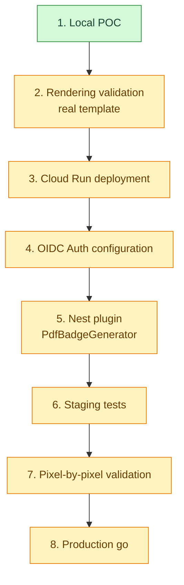

# GCP Gotenberg — Scoping document for the GCP team

> LFD 2026 workstream — Offloading badge/ticket PDF generation to Gotenberg on Cloud Run.
> Goal: absorb generation peaks, secure service-to-service calls, keep Puppeteer as a fallback until validation.

---

## 1. Context and objective

The Attendee application currently generates ticket/badge PDFs with a local Puppeteer instance on the OVH VPS. This generation is CPU-expensive and becomes a risk during registration peaks.

The project consists of deploying a **Gotenberg service on Cloud Run**, called by the OVH Nest API/worker over outbound HTTPS. Cloud Run receives the badge HTML with its assets, renders the PDF with Chromium, then returns the PDF bytes in the HTTP response.

Cloud Run remains **stateless**: it has no knowledge of the database, does not store PDFs, does not call R2, and never calls the Nest API.

---

## 2. Target architecture



---

## 3. Technical sequence



---

## 4. Split of responsibilities

| Topic                 | Rabie / OVH Dev / Nest                                                                            | GCP team                                                         | Proposed decision                                       |
| --------------------- | ------------------------------------------------------------------------------------------------- | ---------------------------------------------------------------- | ------------------------------------------------------- |
| Cloud Run deployment  | **Deploys it himself (project owner)**, picks the region, configures `--no-allow-unauthenticated` | Validates any internal policy                                    | Rabie deploys `gotenberg/gotenberg:8`                   |
| Region                | **Picks `europe-west9` Paris**                                                                    | Confirms internal compliance if constrained                      | Paris                                                   |
| Cloud Run auth        | Generates the OIDC token on the OVH/Nest side + configures `--no-allow-unauthenticated`           | **Creates the Cloud Run Invoker role** (calling service account) | Private Cloud Run + OIDC                                |
| Egress OVH → GCP      | Provides the OVH public IP                                                                        | **Configures the OVH→GCP egress / allowlist**                    | Outbound HTTPS, egress handled on the GCP side          |
| Fonts                 | ✅ **Decided: embedded fonts** (base64 in the request), measures payload                          | Checks potential Cloud Run limits                                | Embedded fonts, no runtime Google Fonts                 |
| Timeout               | Measures the actual generation duration                                                           | Configures the Cloud Run timeout                                 | 60s OK to start with                                    |
| Payload size          | Measures HTML + images + fonts, **adjusts max payload after tests**                               | Confirms acceptable limits                                       | Guardrails, refined after tests                         |
| Concurrency / scaling | Provides volumetry, **adjusts values after staging/prod tests**                                   | Proposes initial values                                          | `min-instances=1` during the event, refined after tests |
| Observability         | Provides **business logs + error codes** (depends on his dev work, phase 5/6)                     | **Configures dashboards + alerts (monitoring owner)**            | Infra from phase 3, business after logs                 |
| PDF retention         | **Handles R2, cache, purge (Rabie)**                                                              | Not involved                                                     | PDFs on the app side, not Cloud Run                     |
| Secrets               | Pragmatic storage on the OVH side for the event                                                   | May recommend Secret Manager                                     | Secret Manager = post-event backlog                     |
| Reversibility         | Keeps the local Puppeteer fallback                                                                | Not involved                                                     | Fallback until pixel validation                         |

---

## 5. Expected from the GCP team

### 5.1 Project and permissions

- Provide or confirm the target GCP project.
- Confirm active billing.
- Grant the permissions needed to deploy or assist the deployment.
- Confirm the allowed region.

### 5.2 Cloud Run

Expected configuration:

```bash
gcloud run deploy badge-generator-service \
  --image gotenberg/gotenberg:8 \
  --region europe-west9 \
  --no-allow-unauthenticated \
  --timeout 60 \
  --min-instances 1
```

To adjust with the GCP team:

- CPU / memory.
- Concurrency.
- Max instances.
- Min instances during event days.
- Scaling policy.

### 5.3 Service-to-service authentication

Expected on the GCP side:

- Create or validate a calling service account.
- Grant the `roles/run.invoker` role on the Cloud Run service.
- Confirm that anonymous calls are rejected.
- Provide the information needed on the OVH side to generate the OIDC token.

Expected on the OVH/Nest side:

- Generate an OIDC token for the Cloud Run audience.
- Send:

```http
Authorization: Bearer <OIDC_TOKEN>
```

### 5.4 Network / egress / allowlist

Desired model:



Questions to settle with the GCP team:

- Is OIDC sufficient under the security policy?
- Should an OVH IP allowlist be added?
- Are there VPC / ingress / org policy constraints?

---

## 6. Requested observability

### 6.1 Expected logs

Each generation must allow quick diagnosis:

```json
{
  "service": "badge-generator-service",
  "eventId": "lfd-2026",
  "attendeeId": "12345",
  "format": "pdf",
  "status": "success|failed",
  "durationMs": 842,
  "payloadBytes": 512000,
  "pdfBytes": 124000,
  "errorCode": "GOTENBERG_TIMEOUT|FONT_MISSING|PAYLOAD_TOO_LARGE|CHROMIUM_ERROR"
}
```

### 6.2 Desired Cloud Monitoring dashboard



### 6.3 Desired alerts

| Alert                      |       Proposed condition | Channel          | Severity       |
| -------------------------- | -----------------------: | ---------------- | -------------- |
| Cloud Run errors           |       5xx > 5% for 5 min | Mail/Teams/Slack | High           |
| Timeouts                   |    > 3 timeouts in 5 min | Mail/Teams/Slack | High           |
| High latency               |      p95 > 10s for 5 min | Mail/Teams/Slack | Medium         |
| Badge generation failures  |   > 20 failures in 5 min | Mail/Teams/Slack | Event-critical |
| Unauthorized calls         | abnormal rise in 401/403 | Mail/Teams/Slack | Security       |
| Massive Puppeteer fallback |  > 10 fallbacks in 5 min | Mail/Teams/Slack | Event-critical |

---

## 7. Plugin strategy on the Nest side

Plugins live on the Nest side, not in Cloud Run.

Cloud Run stays specialized: **HTML → PDF**.

Nest keeps the business orchestration: format selection, fallback, storage, email, business logs.



Business-side usage example:

```ts
await badgeGenerationService.generate("pdf", badgeData);
```

Later:

```ts
await badgeGenerationService.generate("apple-wallet", badgeData);
```

---

## 8. Critical path

> Deliberately **without calendar dates**: dates move, **dependencies** stay true.
> The critical path describes the unavoidable order of the steps and who owns them.

### 8.1 Critical path sequence



### 8.2 Phases and dependencies

| #   | Phase                     | Objective                                                            | Depends on                       | Owner            | Deliverable                                                 | Status   |
| --- | ------------------------- | -------------------------------------------------------------------- | -------------------------------- | ---------------- | ----------------------------------------------------------- | -------- |
| 1   | Local POC                 | Prove Gotenberg renders the badge outside OVH, measure the pixel gap | —                                | Rabie            | Pixel-by-pixel comparator + renders                         | ✅ Done  |
| 2   | Rendering validation      | Replay the comparator on the **final template** (custom fonts)       | 1                                | Rabie            | Measured diff on the real template, embedded fonts decision | 🟡 To do |
| 3   | Cloud Run deployment      | Deploy `gotenberg/gotenberg:8` as a private service                  | Project + billing + region + IAM | GCP team + Rabie | Private Cloud Run service + smoke test                      | 🟡 To do |
| 4   | OIDC Auth configuration   | Authenticated service-to-service call (no anonymous access)          | 3                                | GCP team + Rabie | Service account + `run.invoker` + OIDC token                | 🟡 To do |
| 5   | Nest plugin               | Implement `PdfBadgeGenerator` (OIDC client), Puppeteer fallback kept | 4                                | Rabie            | Nest worker calls Cloud Run                                 | 🟡 To do |
| 6   | Staging tests             | Validate the full flow in staging, **without touching prod**         | 5                                | Rabie            | Badge generated through Cloud Run in staging                | 🟡 To do |
| 7   | Pixel-by-pixel validation | Compare final render vs Puppeteer on the prod template               | 6                                | Rabie            | Validated gap / technical go                                | 🟡 To do |
| 8   | Production go             | Go/no-go decision, prod switch (fallback kept)                       | 7                                | Rabie + team     | PDF generation offloaded in prod                            | 🟡 To do |

> Phases 3 and 4 depend on the GCP team (project, IAM, service account). **All the other
> phases are dev work on the OVH/Nest side** and represent the real workload — detailed in 8.3.

### 8.3 Dev work on the Nest/OVH side (Rabie)

The critical path hides the fact that **most of the code lives on the Nest side**, not in Cloud Run
(which stays a simple `HTML → PDF`). Breakdown of the dev work:

| Dev workstream                  | What needs to be done                                                                                                                          | Phase | Depends on             | Status   |
| ------------------------------- | ---------------------------------------------------------------------------------------------------------------------------------------------- | ----- | ---------------------- | -------- |
| **Fonts**                       | ✅ **Decided: embedded fonts** (base64 in the Gotenberg request). Remaining: embed the template's custom fonts in the POC                      | 2     | Real template exported | 🟡 To do |
| **Badge HTML build**            | Generate the full HTML (QR + CSS + assets + fonts) self-contained, with no network dependency at Gotenberg runtime                             | 2 / 5 | —                      | 🟡 To do |
| **HTTP client + OIDC**          | Generate the OIDC token (audience = Cloud Run URL), call `POST /forms/chromium/convert/html`, handle timeout/retry                             | 4 / 5 | OIDC auth enabled      | 🟡 To do |
| **`PdfBadgeGenerator` plugin**  | Implement the `BadgeGenerator` interface (`format = "pdf"`), wire into `BadgeGenerationService`, architecture open to future formats (wallets) | 5     | OIDC client            | 🟡 To do |
| **Puppeteer fallback**          | Automatic switch to local Puppeteer if Cloud Run fails (timeout/5xx), kept until pixel validation                                              | 5     | Plugin                 | 🟡 To do |
| **R2 storage + idempotency**    | Upload the PDF to R2, cache/idempotency to avoid re-generating, backup link in the email                                                       | 5 / 6 | Plugin                 | 🟡 To do |
| **Business logs + error codes** | Emit `FONT_MISSING` / `PAYLOAD_TOO_LARGE` / `GOTENBERG_TIMEOUT` / `CHROMIUM_ERROR` for diagnosis (ties into GCP monitoring)                    | 5 / 6 | Plugin                 | 🟡 To do |
| **Config / feature flag**       | Puppeteer ↔ Cloud Run switch flag per environment (staging then prod, enabled **after L7**)                                                    | 6 / 8 | Staging tests          | 🟡 To do |

**Parallel workstreams (off the critical path)**: **infra** observability from phase 3 (GCP),
**business** observability after my logs (phase 5/6), wallet plugin architecture preparation. See §9 Backlog.

### 8.4 Provisional planning & call cadence

> Call cadence: **Tuesday & Thursday**. Dates are indicative (adjustable); the **dependencies** are firm.

**My work (Rabie) — solo**

| When                            | Task                                                         | Estimated duration | Depends on                   |
| ------------------------------- | ------------------------------------------------------------ | ------------------ | ---------------------------- |
| Fri 07/10                       | Local POC — real template render, **embedded fonts**         | ~1 d               | —                            |
| Weekend 07/11–12                | Cloud Run deployment (region + `--no-allow-unauthenticated`) | ~0.5 d             | Owner access (OK)            |
| After validation call Tue 07/14 | `PdfBadgeGenerator` plugin + OIDC client                     | ~2–3 d             | OIDC auth + egress validated |
| Right after                     | Business logs + error codes                                  | ~1 d               | Plugin                       |
| Right after                     | Staging tests + **PDF retention (R2)**                       | ~2 d               | Plugin + logs                |
| Right after                     | Pixel-by-pixel validation + go/no-go                         | ~1 d               | Staging OK                   |

**GCP calls (Tue/Thu)**

| Date          | Call                       | Points to cover                                                                                                                                                |
| ------------- | -------------------------- | -------------------------------------------------------------------------------------------------------------------------------------------------------------- |
| Fri 07/10     | Kickoff / document sharing | Present target architecture + responsibilities; start on the GCP side: **Cloud Run Invoker role** + **OVH→GCP egress**; open questions §10                     |
| **Tue 07/14** | **Validation call**        | Validate **region** + **final architecture**; smoke test the **service-to-service connection (egress)** + **OIDC auth**; GCP confirms Invoker; = objective §12 |
| Thu 07/16     | Integration follow-up      | Plugin/staging progress; GCP starts **infra observability**; align on the expected business logs                                                               |
| Tue 07/21     | Staging results            | Adjust **max instances / concurrency / min-instances** + **max payload** based on tests; **business** observability (error codes)                              |
| Thu 07/23     | Final validation           | **Pixel comparison** on the prod template; **prod go/no-go** decision                                                                                          |

**Split during this phase**

- **Rabie**: POC, Cloud Run deployment, plugin, business logs, staging tests, **PDF retention (R2)**.
- **GCP team**: **Cloud Run Invoker role**, **OVH→GCP egress**, **observability** (dashboards + alerts).

> **Logs / monitoring — to clarify on the call.** **Infra** observability (native Cloud Run metrics:
> 5xx, latency, timeouts, 401/403) can be configured **from phase 3**. But **business** observability
> (`FONT_MISSING`, `PAYLOAD_TOO_LARGE`, `GOTENBERG_TIMEOUT`, `CHROMIUM_ERROR` codes) **waits until I
> deliver the business logs (phase 5/6)**: GCP cannot display them before. So yes — for **business**
> monitoring they have to wait for my dev; for **infra** monitoring, no.

---

## 9. Backlog / off the critical path

| Topic                       | Status                     | Why                                          |
| --------------------------- | -------------------------- | -------------------------------------------- |
| Secret Manager              | Post-event nice-to-have    | Too heavy for the critical path 2 months out |
| Apple/Google Wallet         | Architecture prepared only | Not to be implemented now                    |
| Cloud Run export/import     | Future vision              | Out of the immediate Gotenberg scope         |
| Internal UX error dashboard | Optional                   | GCP monitoring is enough to start with       |

---

## 10. Open questions for GCP

1. Do you confirm `europe-west9` Paris?
2. Who provides/creates the calling service account?
3. Which exact method do you want for the OIDC token on the OVH side?
4. Is the OVH IP allowlist required, or is OIDC sufficient?
5. Which payload limits do you want to enforce or monitor?
6. Which CPU/memory/concurrency configuration do you recommend for Chromium/Gotenberg?
7. Can we set `min-instances=1` during critical days?
8. Which alert channels are available: mail, Teams, Slack?
9. Who will have access to Cloud Logging / Cloud Monitoring?
10. Is there an internal log retention constraint?

---

## 11. Proposed decisions

| Decision      | Proposal                                                |
| ------------- | ------------------------------------------------------- |
| Region        | `europe-west9` Paris                                    |
| Auth          | Private Cloud Run + OIDC service account                |
| Call          | OVH → GCP over outbound HTTPS                           |
| PDF storage   | R2 on the application side, not Cloud Run               |
| Fonts         | Fonts embedded in the request                           |
| Timeout       | 60s initially                                           |
| Monitoring    | Cloud Logging + Cloud Monitoring                        |
| Alerts        | Technical + business                                    |
| Secrets       | `.env`/pragmatic storage now, Secret Manager post-event |
| Reversibility | Puppeteer fallback kept                                 |
| Plugins       | On the Nest/API side                                    |

---

## 12. Goal of the next call (Tue 07/14)

By the end of the next call, we must have (or **validate if already done**):

- Cloud Run Gotenberg deployed.
- Manual smoke test OK.
- Private auth (OIDC) clarified or enabled.
- Region validated.
- Metrics/alerts list validated.
- Clear plan to wire Nest in staging — **validated if already done**.
