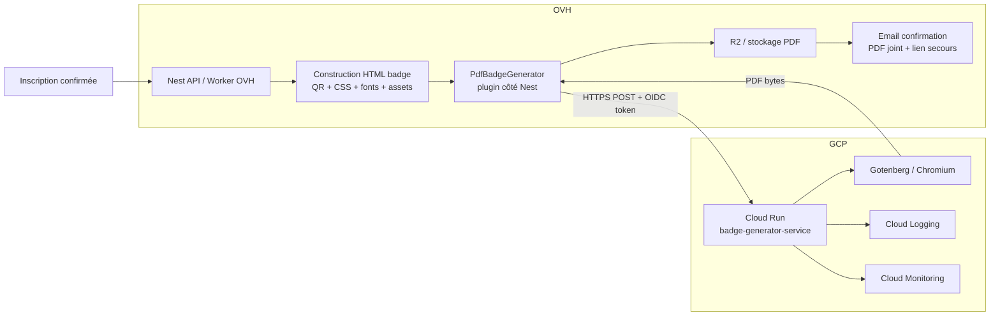
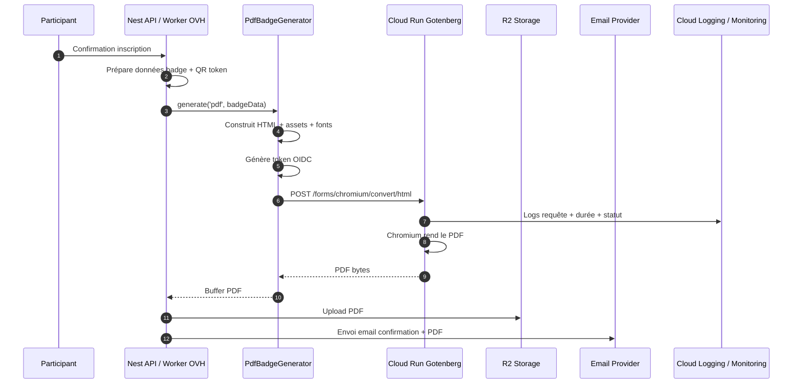
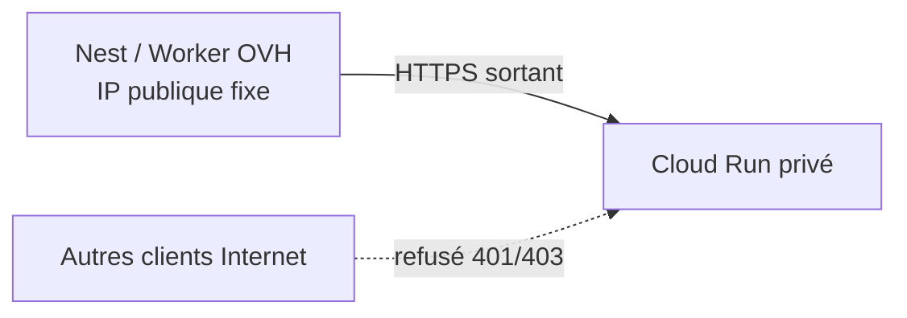
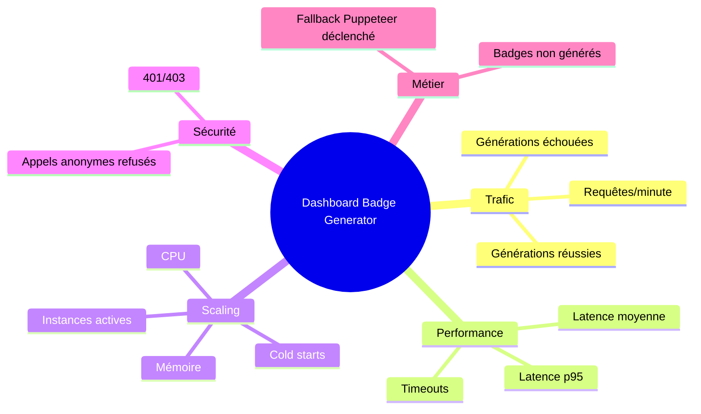
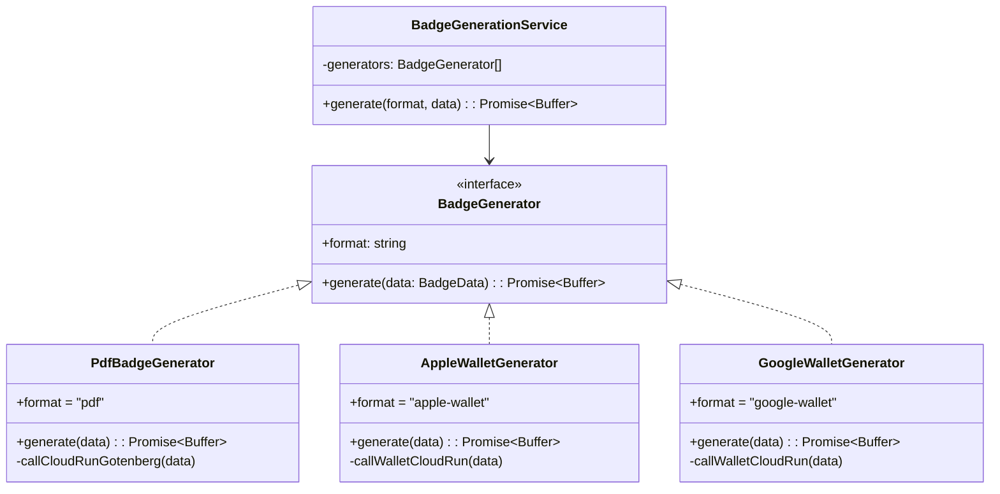
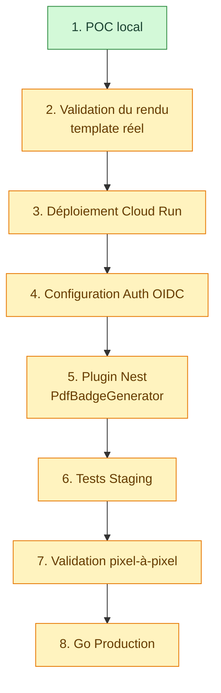

# GCP Gotenberg — Dossier de cadrage équipe GCP

> Workstream LFD 2026 — Déport de la génération PDF badges/billets vers Gotenberg sur Cloud Run.  
> Objectif : absorber les pics de génération, sécuriser l'appel service-to-service, conserver Puppeteer en fallback jusqu'à validation.

---

## 1. Contexte et objectif

L'application Attendee génère aujourd'hui les billets/badges PDF via Puppeteer local sur le VPS OVH. Cette génération est coûteuse CPU et devient un risque lors des pics d'inscription.

Le chantier consiste à déployer un service **Gotenberg sur Cloud Run**, appelé par l'API Nest/worker OVH en HTTPS sortant. Cloud Run reçoit le HTML du badge avec ses assets, rend le PDF via Chromium, puis retourne les octets du PDF dans la réponse HTTP.

Cloud Run reste **stateless** : il ne connaît pas la base de données, ne stocke pas les PDF, n'appelle pas R2 et n'appelle jamais l'API Nest.

---

## 2. Architecture cible



---

## 3. Séquence technique



---

## 4. Répartition des responsabilités

| Sujet | Rabie / Dev OVH / Nest | Équipe GCP | Décision proposée |
|---|---|---|---|
| Déploiement Cloud Run | **Déploie lui-même (owner du projet)**, choisit la région, configure `--no-allow-unauthenticated` | Valide policy interne éventuelle | Rabie déploie `gotenberg/gotenberg:8` |
| Région | **Choisit `europe-west9` Paris** | Confirme conformité interne si contrainte | Paris |
| Auth Cloud Run | Génère le token OIDC côté OVH/Nest + configure `--no-allow-unauthenticated` | **Crée le rôle Cloud Run Invoker** (service account appelant) | Cloud Run privé + OIDC |
| Egress OVH → GCP | Fournit l'IP publique OVH | **Configure l'egress / allowlist OVH→GCP** | HTTPS sortant, egress géré côté GCP |
| Polices | ✅ **Décidé : fonts embarquées** (base64 dans la requête), mesure payload | Vérifie éventuelles limites Cloud Run | Fonts embarquées, pas Google Fonts runtime |
| Timeout | Mesure durée réelle de génération | Configure timeout Cloud Run | 60s OK au départ |
| Payload size | Mesure HTML + images + fonts, **ajuste max payload après tests** | Confirme limites acceptables | Garde-fous, affiné après tests |
| Concurrency / scaling | Donne volumétrie, **ajuste les valeurs après tests staging/prod** | Propose valeurs initiales | `min-instances=1` pendant event, affiné après tests |
| Observabilité | Fournit les **logs métier + codes erreur** (dépend de son dev, phase 5/6) | **Configure dashboards + alertes (owner monitoring)** | Infra dès phase 3, métier après logs |
| Rétention PDF | **Gère R2, cache, purge (Rabie)** | Non concerné | PDF côté app, pas Cloud Run |
| Secrets | Stockage pragmatique côté OVH pour event | Peut conseiller Secret Manager | Secret Manager = backlog post-event |
| Réversibilité | Garde fallback Puppeteer local | Non concerné | Fallback jusqu'à validation pixel |

---

## 5. Points attendus de l'équipe GCP

### 5.1 Projet et permissions

- Fournir ou confirmer le projet GCP cible.
- Confirmer billing actif.
- Donner les permissions nécessaires pour déployer ou accompagner le déploiement.
- Confirmer la région autorisée.

### 5.2 Cloud Run

Configuration attendue :

```bash
gcloud run deploy badge-generator-service \
  --image gotenberg/gotenberg:8 \
  --region europe-west9 \
  --no-allow-unauthenticated \
  --timeout 60 \
  --min-instances 1
```

À ajuster avec l'équipe GCP :

- CPU / mémoire.
- Concurrency.
- Max instances.
- Min instances pendant les jours d'événement.
- Politique de scaling.

### 5.3 Authentification service-to-service

Attendu côté GCP :

- Créer ou valider un service account appelant.
- Donner le rôle `roles/run.invoker` sur le service Cloud Run.
- Confirmer que les appels anonymes sont refusés.
- Fournir les informations nécessaires côté OVH pour générer le token OIDC.

Attendu côté OVH/Nest :

- Générer un token OIDC pour l'audience Cloud Run.
- Envoyer :

```http
Authorization: Bearer <OIDC_TOKEN>
```

### 5.4 Réseau / egress / allowlist

Modèle souhaité :



Questions à trancher avec l'équipe GCP :

- L'OIDC suffit-il selon la politique sécurité ?
- Faut-il ajouter une allowlist IP OVH ?
- Y a-t-il des contraintes VPC / ingress / org policy ?

---

## 6. Observabilité demandée

### 6.1 Logs attendus

Chaque génération doit permettre de diagnostiquer rapidement :

```json
{
  "service": "badge-generator-service",
  "eventId": "lfd-2026",
  "attendeeId": "12345",
  "format": "pdf",
  "status": "success|failed",
  "durationMs": 842,
  "payloadBytes": 512000,
  "pdfBytes": 124000,
  "errorCode": "GOTENBERG_TIMEOUT|FONT_MISSING|PAYLOAD_TOO_LARGE|CHROMIUM_ERROR"
}
```

### 6.2 Dashboard Cloud Monitoring souhaité



### 6.3 Alertes souhaitées

| Alerte | Condition proposée | Canal | Criticité |
|---|---:|---|---|
| Erreurs Cloud Run | 5xx > 5% pendant 5 min | Mail/Teams/Slack | Haute |
| Timeouts | > 3 timeouts en 5 min | Mail/Teams/Slack | Haute |
| Latence élevée | p95 > 10s pendant 5 min | Mail/Teams/Slack | Moyenne |
| Échec génération badge | > 20 échecs en 5 min | Mail/Teams/Slack | Critique event |
| Appels non autorisés | hausse anormale 401/403 | Mail/Teams/Slack | Sécurité |
| Fallback massif Puppeteer | > 10 fallback en 5 min | Mail/Teams/Slack | Critique event |

---

## 7. Stratégie plugins côté Nest

Les plugins sont côté Nest, pas dans Cloud Run.

Cloud Run reste spécialisé : **HTML → PDF**.

Nest garde l'orchestration métier : choix du format, fallback, stockage, email, logs métier.



Exemple d'usage côté métier :

```ts
await badgeGenerationService.generate('pdf', badgeData);
```

Plus tard :

```ts
await badgeGenerationService.generate('apple-wallet', badgeData);
```

---

## 8. Chemin critique

> Volontairement **sans dates calendaires** : les dates bougent, les **dépendances** restent vraies.
> Le chemin critique décrit l'ordre incontournable des étapes et qui les porte.

### 8.1 Séquence du chemin critique



### 8.2 Phases et dépendances

| # | Phase | Objectif | Dépend de | Responsable | Livrable | Statut |
|---|---|---|---|---|---|---|
| 1 | POC local | Prouver que Gotenberg rend le badge hors OVH, mesurer l'écart pixel | — | Rabie | Comparateur pixel-à-pixel + rendus | ✅ Fait |
| 2 | Validation du rendu | Rejouer le comparateur sur le **template définitif** (fonts custom) | 1 | Rabie | Diff mesuré sur template réel, décision fonts embarquées | 🟡 À faire |
| 3 | Déploiement Cloud Run | Déployer `gotenberg/gotenberg:8` en service privé | Projet + billing + région + IAM | Équipe GCP + Rabie | Service Cloud Run privé + smoke test | 🟡 À faire |
| 4 | Configuration Auth OIDC | Appel service-to-service authentifié (pas d'accès anonyme) | 3 | Équipe GCP + Rabie | Service account + `run.invoker` + token OIDC | 🟡 À faire |
| 5 | Plugin Nest | Implémenter `PdfBadgeGenerator` (client OIDC), fallback Puppeteer conservé | 4 | Rabie | Worker Nest appelle Cloud Run | 🟡 À faire |
| 6 | Tests Staging | Valider le flux complet en staging, **sans toucher la prod** | 5 | Rabie | Badge généré via Cloud Run en staging | 🟡 À faire |
| 7 | Validation pixel-à-pixel | Comparer rendu final vs Puppeteer sur template prod | 6 | Rabie | Écart validé / go technique | 🟡 À faire |
| 8 | Go Production | Décision go/no-go, bascule prod (fallback conservé) | 7 | Rabie + équipe | Génération PDF déportée en prod | 🟡 À faire |

> Les phases 3 et 4 dépendent de l'équipe GCP (projet, IAM, service account). **Toutes les autres
> phases sont du dev côté OVH/Nest** et représentent la vraie charge — détaillée en 8.3.

### 8.3 Travail de dev côté Nest/OVH (Rabie)

Le chemin critique masque le fait que **l'essentiel du code est côté Nest**, pas dans Cloud Run
(qui reste un simple `HTML → PDF`). Détail des chantiers de dev :

| Chantier de dev | Ce qu'il faut faire | Phase | Dépend de | Statut |
|---|---|---|---|---|
| **Polices / fonts** | ✅ **Décidé : fonts embarquées** (base64 dans la requête Gotenberg). Reste à embarquer les polices custom du template dans le POC | 2 | Template réel exporté | 🟡 À faire |
| **Construction HTML badge** | Générer le HTML complet (QR + CSS + assets + fonts) autonome, sans dépendance réseau au runtime Gotenberg | 2 / 5 | — | 🟡 À faire |
| **Client HTTP + OIDC** | Générer le token OIDC (audience = URL Cloud Run), appeler `POST /forms/chromium/convert/html`, gérer timeout/retry | 4 / 5 | Auth OIDC activée | 🟡 À faire |
| **Plugin `PdfBadgeGenerator`** | Implémenter l'interface `BadgeGenerator` (`format = "pdf"`), brancher dans `BadgeGenerationService`, architecture ouverte aux futurs formats (wallets) | 5 | Client OIDC | 🟡 À faire |
| **Fallback Puppeteer** | Bascule automatique sur Puppeteer local si Cloud Run échoue (timeout/5xx), conservé jusqu'à validation pixel | 5 | Plugin | 🟡 À faire |
| **Stockage R2 + idempotence** | Upload du PDF sur R2, cache/idempotence pour ne pas re-générer, lien de secours dans l'email | 5 / 6 | Plugin | 🟡 À faire |
| **Logs métier + codes erreur** | Émettre `FONT_MISSING` / `PAYLOAD_TOO_LARGE` / `GOTENBERG_TIMEOUT` / `CHROMIUM_ERROR` pour diagnostic (lie au monitoring GCP) | 5 / 6 | Plugin | 🟡 À faire |
| **Config / feature flag** | Flag de bascule Puppeteer ↔ Cloud Run par environnement (staging puis prod, activé **après L7**) | 6 / 8 | Tests staging | 🟡 À faire |

**Chantiers parallèles (hors chemin critique)** : observabilité **infra** dès la phase 3 (GCP),
observabilité **métier** après mes logs (phase 5/6), préparation architecture plugins wallets. Voir §9 Backlog.

### 8.4 Planning prévisionnel & rituels de call

> Rythme de call : **mardi & jeudi**. Dates indicatives (ajustables) ; les **dépendances**, elles, sont fermes.

**Mon travail (Rabie) — solo**

| Quand | Tâche | Durée estimée | Dépend de |
|---|---|---|---|
| Ven 10/07 | POC local — rendu template réel, **fonts embarquées** | ~1 j | — |
| Weekend 11–12/07 | Déploiement Cloud Run (région + `--no-allow-unauthenticated`) | ~0,5 j | Accès owner (OK) |
| Après validation call mar. 14/07 | Plugin `PdfBadgeGenerator` + client OIDC | ~2–3 j | Auth OIDC + egress validés |
| Enchaîné | Logs métier + codes erreur | ~1 j | Plugin |
| Enchaîné | Tests staging + **rétention PDF (R2)** | ~2 j | Plugin + logs |
| Enchaîné | Validation pixel-à-pixel + go/no-go | ~1 j | Staging OK |

**Calls GCP (mar/jeu)**

| Date | Call | Points à évoquer |
|---|---|---|
| Ven 10/07 | Kickoff / partage dossier | Présenter archi cible + responsabilités ; lancer côté GCP : **rôle Cloud Run Invoker** + **egress OVH→GCP** ; questions ouvertes §10 |
| **Mar 14/07** | **Call validation** | Valider **région** + **archi finale** ; smoke test **connexion service-to-service (egress)** + **auth OIDC** ; GCP confirme Invoker ; = objectif §12 |
| Jeu 16/07 | Suivi intégration | Avancement plugin/staging ; GCP démarre **observabilité infra** ; caler les logs métier attendus |
| Mar 21/07 | Résultats staging | Ajuster **max instances / concurrency / min-instances** + **max payload** selon tests ; observabilité **métier** (codes erreur) |
| Jeu 23/07 | Validation finale | **Comparaison pixel** template prod ; décision **go/no-go prod** |

**Répartition pendant cette phase**

- **Rabie** : POC, déploiement Cloud Run, plugin, logs métier, tests staging, **rétention PDF (R2)**.
- **Équipe GCP** : **rôle Cloud Run Invoker**, **egress OVH→GCP**, **observabilité** (dashboards + alertes).

> **Logs / monitoring — à clarifier au call.** L'**observabilité infra** (métriques natives Cloud Run :
> 5xx, latence, timeouts, 401/403) est configurable **dès la phase 3**. Mais l'**observabilité métier**
> (codes `FONT_MISSING`, `PAYLOAD_TOO_LARGE`, `GOTENBERG_TIMEOUT`, `CHROMIUM_ERROR`) **attend que je
> livre les logs métier (phase 5/6)** : GCP ne peut pas les afficher avant. Donc oui — pour le monitoring
> **métier**, ils doivent attendre mon dev ; pour le monitoring **infra**, non.

---

## 9. Backlog / hors chemin critique

| Sujet | Statut | Pourquoi |
|---|---|---|
| Secret Manager | Nice-to-have post-event | Trop lourd pour le chemin critique à 2 mois |
| Wallet Apple/Google | Architecture préparée seulement | Pas à implémenter maintenant |
| Export/import Cloud Run | Vision future | Hors périmètre Gotenberg immédiat |
| Dashboard UX interne des erreurs | Optionnel | Monitoring GCP suffisant au départ |

---

## 10. Questions ouvertes pour GCP

1. Confirmez-vous `europe-west9` Paris ?
2. Qui fournit/crée le service account appelant ?
3. Quelle méthode exacte souhaitez-vous pour le token OIDC côté OVH ?
4. L'allowlist IP OVH est-elle exigée ou OIDC suffit-il ?
5. Quelles limites payload souhaitez-vous appliquer ou surveiller ?
6. Quelle configuration CPU/mémoire/concurrency recommandez-vous pour Chromium/Gotenberg ?
7. Peut-on mettre `min-instances=1` pendant les jours critiques ?
8. Quels canaux d'alerte sont disponibles : mail, Teams, Slack ?
9. Qui aura accès à Cloud Logging / Cloud Monitoring ?
10. Y a-t-il une contrainte interne de rétention des logs ?

---

## 11. Décisions proposées

| Décision | Proposition |
|---|---|
| Région | `europe-west9` Paris |
| Auth | Cloud Run privé + OIDC service account |
| Appel | OVH → GCP en HTTPS sortant |
| Stockage PDF | R2 côté application, pas Cloud Run |
| Fonts | Fonts embarquées dans la requête |
| Timeout | 60s initialement |
| Monitoring | Cloud Logging + Cloud Monitoring |
| Alertes | Techniques + métier |
| Secrets | `.env`/stockage pragmatique maintenant, Secret Manager post-event |
| Réversibilité | Puppeteer fallback conservé |
| Plugins | Côté Nest/API |

---

## 12. But du prochain call (mar. 14/07)

À la fin du prochain call, on doit avoir (ou **valider si déjà fait**) :

- Cloud Run Gotenberg déployé.
- Smoke test manuel OK.
- Auth privée (OIDC) clarifiée ou activée.
- Région validée.
- Liste des métriques/alertes validée.
- Plan clair pour brancher Nest en staging — **validé si déjà fait**.

