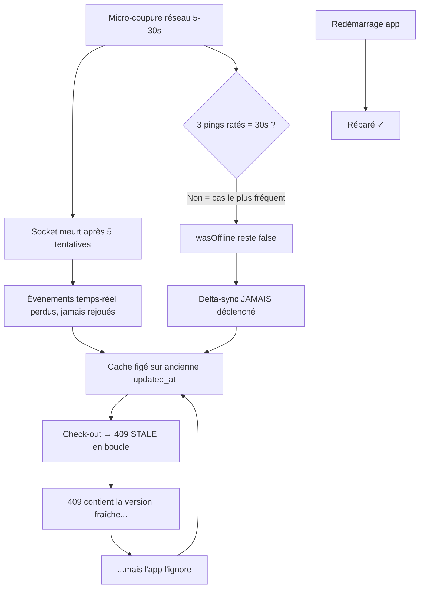
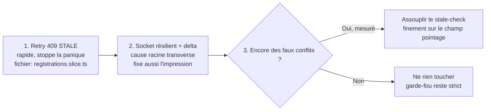

# 03 — Socket résilient + delta-sync à la reconnexion

> Diagnostic établi en session — 2026-06-15  
> Statut : **IMPLÉMENTÉ — 2026-06-18** (voir section 7 ci-dessous)  
> App : `attendee-ems-mobile`  
> Fichiers clés : `src/hooks/useNetworkMonitor.ts`, `src/store/offlineCheckIn.ts`, socket.io config

---

## 1. Pourquoi ce chantier existe

### Le problème de prod observé

Lors d'une **micro-coupure réseau** (5–30 s), le cache de l'app se **fige silencieusement** :
- Les nouveaux check-ins/check-outs d'autres tablettes n'arrivent plus.
- Les modifications faites sur la web app pendant la coupure sont perdues.
- Un redémarrage complet de l'app "répare" tout — ce qui est le signe d'un problème de reconnexion, pas d'un vrai bug métier.

### Ce qu'on a prouvé dans les logs (timeline réelle)

```
18:05:55  Health check failed (1/3)
18:06:05  Health check failed (2/3)
          ← JAMAIS de (3/3), JAMAIS "Triggering delta sync"
18:06:20  check-out → 409 STALE_CLIENT_STATE   ❌
18:07:11  check-out → 409 STALE_CLIENT_STATE   ❌  (+51s)
18:08:45  check-out → 409 STALE_CLIENT_STATE   ❌  (+1m34s)
```

→ 3 tentatives sur 2 min 30, toutes en STALE, aucun delta-sync déclenché. Cache périmé **indéfiniment**.

---

## 2. Diagnostic technique

### 2.1 — Le socket meurt après 5 tentatives et ne se relance jamais

Config actuelle dans le code mobile :

```ts
reconnectionAttempts: 5   // ← seulement 5 tentatives (~5s d'échec)
// + aucun handler reconnect_failed
```

Une fois les 5 tentatives épuisées, le socket reste **mort définitivement** tant que l'app reste ouverte. `connect()` n'est rappelé que si :
- `isAuthenticated` change (changement d'auth), ou
- l'app est remountée (= redémarrage).

**Conséquence :** une coupure réseau courte tue le temps-réel pour le reste de la session.

### 2.2 — Le delta-sync ne se déclenche pas sur les coupures courtes

Le delta-sync de rattrapage ([`useNetworkMonitor.ts#L48`](../../../../attendee-ems-mobile/src/hooks/useNetworkMonitor.ts)) est verrouillé derrière une condition :

```ts
if (wasOfflineRef.current) {
  // déclenche le delta-sync
}
```

Or « passer hors-ligne » exige **3 pings ratés d'affilée ≈ 30 secondes** ([`useNetworkMonitor.ts#L22`](../../../../attendee-ems-mobile/src/hooks/useNetworkMonitor.ts)).

**La fenêtre piège :**

| Durée de coupure | Socket | Passage offline | Delta-sync | Résultat |
|---|---|---|---|---|
| < 5s | Survit | Non | Non | ✅ OK |
| 5–30s | **Mort** | Non | **Non** | ❌ Cache figé |
| > 30s | Mort | Oui | **Oui** | ✅ Réparé par le delta |

→ La tranche **5–30 s** est exactement la fenêtre de prod (perte de Wi-Fi courte, réseau 4G instable, couloir entre deux salles).



### 2.3 — Impact transverse : le client d'impression aussi

Ce même socket `/events` véhicule **aussi** les événements d'impression (`Printers updated`, `print-job:created`). Si le socket est mort :
- Une imprimante branchée/débranchée n'est jamais signalée à la tablette.
- Un job d'impression lancé depuis le back n'arrive jamais sur l'app.

Vu dans les logs : `[Socket] Printers updated: 6/8 printer(s)`.  
→ Le socket résilient n'est **pas** une amélioration de confort, c'est un fix structurel qui touche **check-in, check-out ET impression**.

---

## 3. La solution

### 3.1 — Reconnexions infinies avec backoff exponentiel

Remplacer `reconnectionAttempts: 5` par des reconnexions infinies avec backoff :

```ts
// Avant
io(SERVER_URL, {
  reconnectionAttempts: 5,
  transports: ['websocket'],
})

// Après
io(SERVER_URL, {
  reconnectionAttempts: Infinity,       // ne jamais abandonner
  reconnectionDelay: 1000,              // 1s au 1er essai
  reconnectionDelayMax: 30000,          // plafond à 30s
  randomizationFactor: 0.5,            // jitter pour éviter les avalanches
  transports: ['websocket'],
})
```

Ajouter un handler `reconnect_failed` qui force un nouveau `connect()` si jamais la librairie abandonne (filet de sécurité) :

```ts
socket.on('reconnect_failed', () => {
  console.warn('[Socket] Reconnect failed — forcing new connect()');
  socket.connect();
});
```

**Fichier :** probablement `src/hooks/useSocket.ts` ou `src/store/socket.ts` (à vérifier selon architecture).

### 3.2 — Déclencher un delta-sync à chaque reconnexion réussie

Aujourd'hui le delta-sync ne se déclenche qu'au retour réseau (passage offline). Il faut aussi le déclencher **à chaque reconnexion socket réussie** :

```ts
socket.on('reconnect', (attemptNumber) => {
  console.log(`[Socket] Reconnected after ${attemptNumber} attempts`);
  // Déclencher le delta-sync pour rattraper tout ce qu'on a manqué
  dispatch(triggerDeltaSync({ eventId: currentEventId }));
});
```

Pourquoi c'est différent du passage offline : le socket peut mourir **sans** que `useNetworkMonitor` le sache (timeout serveur, erreur transport, etc.). Le delta-sync à la reconnexion est donc **complémentaire**, pas redondant.

**Fichier :** `src/hooks/useNetworkMonitor.ts` + le hook qui gère le socket.

### 3.3 — (Optionnel) Affiner le seuil de passage offline

Le seuil de 3 pings consécutifs (~30s) pour déclencher le delta-sync est trop haut pour les coupures courtes de prod. Si on veut doubler la protection :

```ts
// Avant : 3 pings ratés = ~30s
// Après : 2 pings ratés = ~20s (ou réduire l'intervalle)
```

Mais **ce n'est pas prioritaire** : si le fix 3.2 (delta-sync à la reconnexion socket) est en place, ce seuil devient peu important.

---

## 4. Ce que ça corrige (périmètre)

| Problème | Fix 3.1 (reconnexion infinie) | Fix 3.2 (delta à reconnexion) |
|---|---|---|
| Cache figé après micro-coupure | ✅ (le socket se reconnecte) | ✅ (rattrapage des événements manqués) |
| Jobs impression perdus après coupure | ✅ | ✅ |
| Stats event qui se figent | ✅ | ✅ |
| 409 STALE en boucle | ❌ (cause différente — voir fix retry 409) | Partiellement (le cache se met à jour) |

---

## 5. Ordre de priorité par rapport aux autres fixes



- **Fix 1 (retry 409)** : le plus rapide à implémenter, stoppe immédiatement les erreurs rouges en boucle.
- **Fix 2 (socket résilient)** : la correction structurelle. Traiter tôt car transverse.
- **Fix 3 (stale-check assoupli)** : optionnel, conditionnel à une mesure post-déploiement.

---

## 6. Risques et points d'attention

| Risque | Probabilité | Mitigation |
|---|---|---|
| Reconnexions en boucle si le serveur est vraiment down | Faible | Le backoff exponentiel (plafond 30s) limite l'impact |
| Delta-sync déclenché trop souvent | Faible | Le delta-sync est idempotent et léger (seuls les `updated_at` > la dernière sync sont rapatriés) |
| Interférence avec le système de wake-lock / foreground | À vérifier | Tester sur tablette physique en arrière-plan |
| Le socket de l'imprimante et celui du check-in sont-ils le même ? | À confirmer | Vérifier dans le code source que c'est bien `/events` pour les deux |

---

## 7. Fichiers à modifier

| Fichier | Modification |
|---|---|
| `src/hooks/useSocket.ts` ou équivalent | Remplacer `reconnectionAttempts: 5` par `Infinity` + backoff + handler `reconnect_failed` |
| `src/hooks/useNetworkMonitor.ts` | Ajouter le dispatch delta-sync sur l'événement `reconnect` du socket |
| `src/store/offlineCheckIn.ts` | Vérifier que `triggerDeltaSync` est bien exposé et appelable depuis le hook socket |

> **Note :** Ne pas implémenter avant l'event du 16 juin 2026. À programmer après stabilisation.

---

## 8. Implémentation réalisée — 2026-06-18

Statut : **livré** sur `main` (`attendee-ems-mobile`). Implémenté en deux chantiers parallèles (A = socket résilient, B = détection hors-ligne robuste), plus deux correctifs de bugs découverts pendant les tests.

### 8.1 — Socket résilient (chantier A)

| Fichier | Ce qui a été fait |
|---|---|
| `src/api/socket.types.ts` (nouveau) | Typage de tous les payloads socket (fin des `any`) : `SocketStatus`, `RegistrationEventPayload`, `DeletedEventPayload`, `EventEventPayload`, `SessionEventPayload`, `PrinterPayload`, `PrintJobUpdatePayload` |
| `src/api/socket.service.ts` | `reconnectionAttempts: Infinity`, `reconnectionDelay: 1000`, `reconnectionDelayMax: 10000`, transports `['websocket','polling']`. Handler `disconnect` → force la reconnexion si `io server disconnect`. Handler `connect_error` → si erreur d'auth (jwt/token/unauthorized), rafraîchit le token puis reconnecte. Événements manager `reconnect_attempt` (statut connecting) et `reconnect` (statut connected + callback delta-sync). Nouveaux callbacks exposés : `setReconnectCallback`, `setStatusChangeCallback`, `setDisconnectProbeCallback` |
| `src/store/network.slice.ts` | Ajout de `socketStatus` (`connected` / `connecting` / `disconnected`) + action `setSocketStatus` |
| `src/components/ui/SocketStatusBanner.tsx` (nouveau) | Bandeau ambre « Temps reel interrompu -- reconnexion en cours… » affiché uniquement si online ET socket non connecté, avec debounce 2,5 s anti-clignotement |
| `src/AppContent.tsx` | Montage du `SocketStatusBanner` |
| `src/hooks/useSocketSync.ts` | Handlers typés. Câblage : `setStatusChangeCallback` → `setSocketStatus`, `setReconnectCallback` → `triggerDeltaSyncThunk`, `setDisconnectProbeCallback` → sonde réseau immédiate |
| `src/store/registrations.slice.ts` | Nouveau `triggerDeltaSyncThunk` (lit `currentEventId` + `lastSyncTimestamp`, fenêtre de repli 5 min, dispatch `fetchDeltaRegistrationsThunk`) déclenché à chaque reconnexion socket |

**Effet :** le socket ne meurt plus jamais définitivement ; à chaque reconnexion réussie un delta-sync rattrape les check-ins/éditions manqués (y compris les jobs d'impression qui transitent par le même socket `/events`).

### 8.2 — Détection hors-ligne rapide + assouplissement 409 STALE (chantier B)

| Fichier | Ce qui a été fait |
|---|---|
| `src/hooks/useNetworkMonitor.ts` | Polling adaptatif : 10 s en régime normal, 2 s dès qu'un échec suspect apparaît. Timeout du health-check réduit de 5 s à 3 s. Sonde immédiate (`probe`) déclenchable par les autres couches. Le seuil anti-flicker reste à 3 échecs. Résultat : détection hors-ligne en ~4-6 s (avant ~30-48 s) |
| `src/store/networkProbe.ts` (nouveau) | Registre découplé `setNetworkProbe` / `requestImmediateNetworkCheck` (évite les dépendances circulaires) |
| `src/api/backend/axiosClient.ts` | Sur erreur réseau / `ECONNABORTED`, déclenche `requestImmediateNetworkCheck()` |
| `src/api/backend/registrations.service.ts` | Timeout court (`MUTATION_TIMEOUT_MS = 12000`) sur les 4 mutations check-in/out → ne bloque plus 30 s quand le réseau lâche |
| `src/store/offlineCheckIn.ts` | Nouvel exécuteur résilient `executeResilient` partagé par les 4 fonctions : si online → appel ; sur **409 STALE_CLIENT_STATE** → merge la version fraîche du serveur + **retry silencieux 1×** (aucun message rouge) ; sur erreur réseau / timeout → bascule optimiste offline (update + enqueue) ; sur erreur métier réelle → remonte à l'appelant |
| `src/hooks/useCheckIn.ts` | Le code `ALREADY_CHECKED_IN` mappe désormais explicitement le message rouge FR « Cette personne est déjà enregistrée. » + reflète l'état serveur frais. Le STALE ne remonte plus jusqu'ici (traité en amont) |

**Effet :** plus de message rouge injustifié sur un simple cache en retard ; le hors-ligne s'enclenche vite ; les conflits métier réels restent signalés.

### 8.3 — Bugs corrigés pendant les tests

| Bug | Cause | Fix |
|---|---|---|
| **Écran gris (crash total) à la reconnexion après check-in puis undo-check-in offline** | `ConflictsBanner.tsx` appelait `useCallback` **après** un `return null` conditionnel → violation des Rules of Hooks. Tant qu'aucun conflit n'existait : 3 hooks ; dès qu'un conflit apparaissait : 4 hooks → React casse l'arbre | Déplacement du `useCallback` avant le retour conditionnel |
| **Action + action inverse en offline → faux conflit STALE + état final incohérent** | check-in puis undo-check-in généraient 2 mutations ; au rejeu, le check-in avançait `updated_at` → l'undo partait avec un timestamp périmé → 409 STALE inutile, et la personne restait "checked-in" | `mutationQueue.ts` : neutralisation des mutations opposées à l'enqueue (un `undo-check-in` annule un `check-in` encore en file → les deux disparaissent, zéro appel serveur) |

### 8.4 — Correctif build EAS

| Problème | Fix |
|---|---|
| Build EAS Android échouait à l'étape « Configure expo-updates » (Unknown error) | `app.json` : `runtimeVersion` était passé en `{ policy: "fingerprint" }` sans le package `@expo/fingerprint` installé → retour à une version statique `"1.1.9"`. (Voir backlog OTA 🟠 : la stratégie fingerprint reste à mettre en place proprement avec la dépendance.) |

### 8.5 — Print-client

Vérifié : `attendee-ems-print-client/main-native.js` était **déjà** résilient (reconnexions infinies, backoff, gestion `io server disconnect`, transports websocket+polling). Aucun changement — sert de référence.

### 8.6 — Commits associés (2026-06-18)

- `feat(mobile): add SocketStatusBanner for real-time connection status`
- (chantiers A+B intégrés via merge `8259889`)
- `fix(offline): neutralize opposite mutations in queue (check-in then undo-check-in = noop)`
- `fix(build): revert runtimeVersion to static 1.1.9 (fingerprint policy missing @expo/fingerprint dep)`

### 8.7 — Reste à faire

- Tests sur tablette physique (APK preview EAS) des 6 scénarios : redémarrage API, édition web pendant socket mort, double check-in, mode avion pendant check-in, coupure réseau serveur, job d'impression après reconnexion + le scénario du crash (check-in/undo offline).
- OTA / stratégie `runtimeVersion` fingerprint propre (backlog 🟠).
